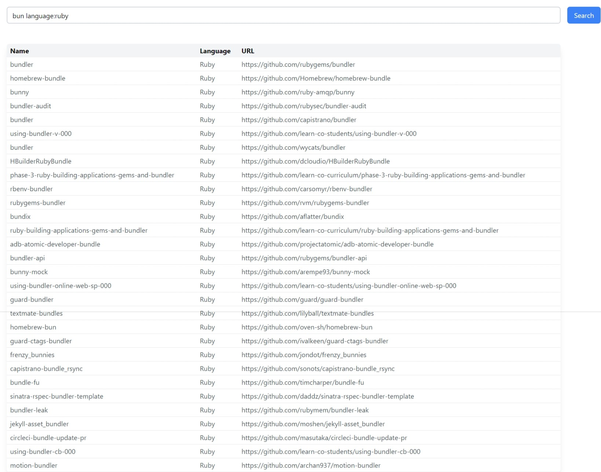

# Github Search

A simple Github API V2022 wrapper in ruby and a frontend to display results.

Nonfunctional requirements that are most likely to be present in production use but skipped here.

* Test cases.
* Authentication for API.
* Authorization and roles for this API endpoint.
* Different rate limiting for guests/users.
* Proper frontend framework.

## Instructions to use

Install [docker](https://docs.docker.com/engine/install)

clone the repository
```sh
git clone https://github.com/eng-awais/github-search.git
```
Go to project folder
```sh
cd github-search
```
Build and Run application
```sh
docker-compose up
```
Goto URL localhost:3000 in your preferred browser and use provided search bar to search for repositories. (Every Github repo search keyword is supported).


